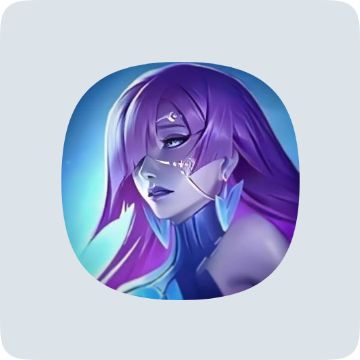

# Squircle Shape


[](https://android-arsenal.com/api?level=23)
[](https://github.com/stoyan-vuchev/squircle-shape/commits/master)
[](https://github.com/stoyan-vuchev/squircle-shape/issues)
[](https://jetc.dev/issues/168.html)

> A Compose Multiplatform library providing customizable Squircle shapes for UI components.

---

## ✨ Features

- **Customizable Squircle Shapes**: Create UI shapes that smoothly transition between squares and circles.
- **Integration with `MaterialTheme`**: Use squircle shapes directly in Jetpack Compose themes.
- **Corner Smoothing**: Fine-tune the smoothness of corners for a delightful design.
- **Multiplatform Support**: Available for Android, iOS, Desktop (JVM), and Web (WasmJS).
- **Canvas Drawing**: Easily draw squircle shapes on canvases with `drawSquircle()`.

---

## ⚠️‼️📢 Important Notice

- **The library namespace has changed**:
  </br>
  New library versions will be published using the `com.stoyanvuchev` namespace.
  </br>
  Consider replacing `io.github.stoyan-vuchev` with `com.stoyanvuchev`.
  <br/>
  Check out the updated Setup guide [here](#-setup)

---

## 🆕 What's New in Version 5.0.0?

**‼️ Breaking Changes**:  
- The corner scaling that was used to keep the corner radius somewhat consistent with a RoundedCornerShape was removed due to geometrical limitations and shape inconsistency with nested UI components.
- To balance things out, consider increasing the corner radius when using a larger corner smoothing value.

---

## 📋 Minimum Requirements

### For Multiplatform Projects:
- Kotlin: `2.3.0`
- Compose: `1.11.0-alpha01`

### For Android-only Projects:
- Kotlin: `2.3.0`
- Jetpack Compose: `1.11.0-alpha02`
- Minimum SDK: `23`
- Compile SDK: `36`

---

## 📦 Setup

### Gradle Kotlin DSL (Multiplatform)

1. Add the dependency in your shared module's `build.gradle.kts`:
* Latest version: 

```kotlin
sourceSets {
    
    val commonMain by getting {
        
        dependencies {
            
            // ...
            
            implementation("com.stoyanvuchev:squircle-shape:5.0.0")
          
        }
      
    }

    // ...
  
}
```

* Or if you're using a version catalog (e.g. `libs.versions.toml`), declare it in the catalog instead.

```toml
[versions]
squircle-shape = "5.0.0"

[libraries]
squircle-shape = { group = "com.stoyanvuchev", name = "squircle-shape", version.ref = "squircle-shape" }
```

* Then include the dependency in your shared module `build.gradle.kts` file.

```kotlin
sourceSets {

  val commonMain by getting {

    dependencies {

      // ...

      implementation(libs.squircle.shape)

    }

  }

  // ...

}
```

2. Sync and rebuild the project. 🔄️🔨✅

---

## Gradle Kotlin DSL Setup (For Android-only projects).

1. Add the Squircle Shape dependency in your module `build.gradle.kts` file.
* Latest version: 

```kotlin
dependencies {
            
    // ...

    implementation("com.stoyanvuchev:squircle-shape-android:5.0.0")
  
}
```

* Or if you're using a version catalog (e.g. `libs.versions.toml`), declare it in the catalog instead.

```toml
[versions]
squircle-shape = "5.0.0"

[libraries]
squircle-shape = { group = "com.stoyanvuchev", name = "squircle-shape-android", version.ref = "squircle-shape" }
```

* Then include the dependency in your module `build.gradle.kts` file.

```kotlin
dependencies {

  // ...

  implementation(libs.squircle.shape)

}
```

2. Sync and rebuild the project. 🔄️🔨✅

---

## 🚀 Usage

### 1. **Using Squircle Shapes with `MaterialTheme`**

Define squircle shapes in your theme to use them consistently across your app:

```kotlin
val shapes = Shapes(
    small = SquircleShape(radius = 16.dp, cornerSmoothing = CornerSmoothing.Medium),
    medium = SquircleShape(radius = 32.dp, cornerSmoothing = CornerSmoothing.Medium),
    large = SquircleShape(percent = 100, cornerSmoothing = CornerSmoothing.Medium)
)

MaterialTheme(
    shapes = shapes
) {

    // ...

    Button(
        onClick = { /* Action */ },
        shape = MaterialTheme.shapes.large // Clipped to the provided `large` material theme shape.
    ) {
        Text(text = "Full Squircle")
    }

    // ...

}
```


### 2. **Using Squircle Shapes separately**

Clip UI components separately by using a `SquircleShape()` function.

```kotlin
Image(
    modifier = Modifier
        .size(128.dp)
        .clip(
            shape = SquircleShape(
                percent = 100,
                cornerSmoothing = CornerSmoothing.Medium
            )
        ), // Clipped to a fully rounded squircle shape.
    painter = painterResource(R.drawable.mlbb_novaria),
    contentDescription = "An image of Novaria.",
    contentScale = ContentScale.Crop
)
```



You can customize the radii for all corners, or for each corner independently.
Supported corner values are:

- `Int` for percent-based corner radius in range 0..100 
- `Float` for pixel-based corner radius e.g. `50f`
- `Dp` for density pixel-based corner radius e.g. `16.dp`

```kotlin
// Single-corner percent-based radius implementation.
SquircleShape(
    percent = 100,
    cornerSmoothing = .6f
)

// Single-corner pixel-based radius implementation.
SquircleShape(
    radius = 32f,
    cornerSmoothing = .6f
)

// Single-corner density pixel-based radius implementation.
SquircleShape(
    radius = 32.dp,
    cornerSmoothing = .6f
)

// Multi-corner percent-based radius implementation.
SquircleShape(
    topStart = 25,
    topEnd = 5,
    bottomStart = 25,
    bottomEnd = 5,
    cornerSmoothing = .6f
)

// Multi-corner pixel-based radius implementation.
SquircleShape(
    topStart = 32f,
    topEnd = 8f,
    bottomStart = 32f,
    bottomEnd = 8f,
    cornerSmoothing = .6f
)

// Multi-corner density pixel-based radius implementation.
SquircleShape(
    topStart = 32.dp,
    topEnd = 8.dp,
    bottomStart = 32.dp,
    bottomEnd = 8.dp,
    cornerSmoothing = .6f
)
```

### 3. Draw a Squircle on Canvas

You can draw squircle shapes on a canvas for custom graphics.

Note: currently `drawSquircle` only accepts pixel-based values for each corner:

```kotlin
Canvas(
    modifier = Modifier.size(150.dp),
    onDraw = {
    
        drawSquircle(
            color = Color.Blue,
            topLeft = Offset.Zero,
            size = this.size,
            topLeftCorner = 32.dp.toPx(),
            topRightCorner = 8.dp.toPx(),
            bottomRightCorner = 32.dp.toPx(),
            bottomLeftCorner = 8.dp.toPx(),
            cornerSmoothing = .6f
        )
    
    }
)
```

---

## 📄 License
```
MIT License

Copyright (c) 2023-2025 Stoyan Vuchev

Permission is hereby granted, free of charge, to any person obtaining a copy
of this software and associated documentation files (the "Software"), to deal
in the Software without restriction, including without limitation the rights to
use, copy, modify, merge, publish, distribute, sublicense, and/or sell copies
of the Software, and to permit persons to whom the Software is furnished to do so, subject to the following conditions:

The above copyright notice and this permission notice shall be included in all copies or substantial portions of the Software.

THE SOFTWARE IS PROVIDED "AS IS", WITHOUT WARRANTY OF ANY KIND, EXPRESS OR
IMPLIED, INCLUDING BUT NOT LIMITED TO THE WARRANTIES OF MERCHANTABILITY,
FITNESS FOR A PARTICULAR PURPOSE AND NONINFRINGEMENT. IN NO EVENT SHALL THE
AUTHORS OR COPYRIGHT HOLDERS BE LIABLE FOR ANY CLAIM, DAMAGES OR OTHER
LIABILITY, WHETHER IN AN ACTION OF CONTRACT, TORT OR OTHERWISE, ARISING FROM,
OUT OF OR IN CONNECTION WITH THE SOFTWARE OR THE USE OR OTHER DEALINGS IN THE
SOFTWARE.
```

---

## 👤 Contact

Created by [@stoyan-vuchev](https://github.com/stoyan-vuchev/) – feel free to reach out!

📧 Email: [contact@stoyanvuchev.com](mailto:://contact@stoyanvuchev.com)
